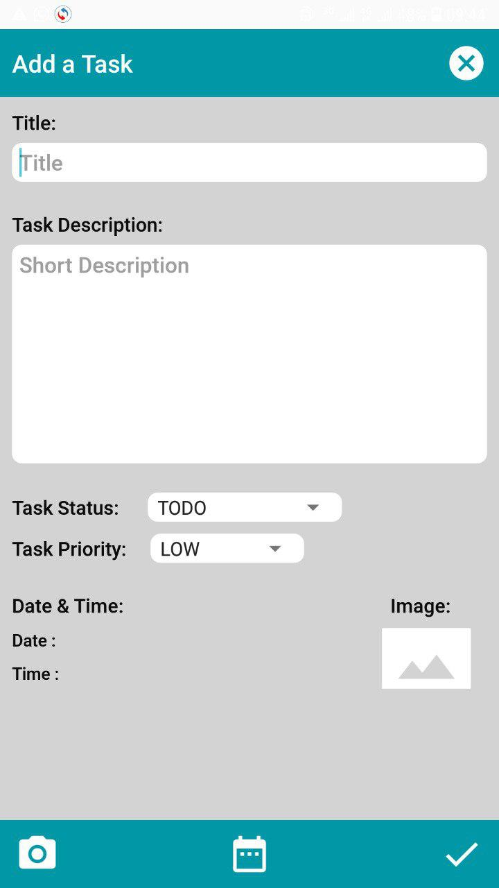

## Android Ala-Too Kanban

This application help to manage your time!!!

> A kanban board is an agile project management tool designed to help visualize work,
> limit work-in-progress, and maximize efficiency (or flow). 

Checkout the design in [Figma Draft](https://www.figma.com/file/zjI8MgWFxqXZB9LkRA6Rhs/Untitled?node-id=0%3A1)

  
  
